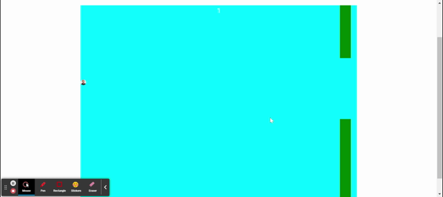

# Animal-Crusade

 

<h3 align="center">Animal Crusade</h3>

  

    Help Jerome get to the end of the bootcamp
     
  

  
Table of Contents

  <ol>
    <li>
      <a href="#about-the-project">About The Project</a>
      <ul>
        <li><a href="#tools-used">Tools used</a></li>
      </ul>
    </li>
    <li>
      <a href="#instructions">Instructions</a>
        </li>
    <li><a href="#Collaborators">Collaborators</a></li>
    <li><a href="#license">License</a></li>
    <li><a href="#contact">Contact</a></li>
  </ol>

## About The Project

The motivation behind this project was to build an interactive game inspired by the most talented developer in the known universe, the one and only, Jerome Chenette. Utilizing the magic of react-game-engine, we created a game inspired by Flappy Bird. The goal of the game is help Jerome navigate through obstacals to complete a intense bootcamp. 

(<a href="#top">back to top</a>)

### Tools used

* JavaScript
* React
* CSS
* React-game-engine
* Styled-components

(<a href="#top">back to top</a>)

## Instructions

Once you have navagated to the deployed link below: 

- Are prompted to create an account or login if you already have an account.
- Once you login, you are able to play the game helping Jerome navigate through the bootcamp.
- During each round, your score is presented at the top of the game window and highscores are saved to your account. 

<b>Signup & Login</b>
 

<b>Game:</b>
 

(<a href="#top">back to top</a>)

## License

Distributed under the MIT License. See `LICENSE.txt` for more information.

(<a href="#top">back to top</a>)

## Contact

[Henry Nguyen](hln11244@gmail.com) 

[Chelsea Burnham](chelseaburnham0@gmail.com)

[Sufyaan Vaidya](vaidyasufyaan@gmail.com)

[Repository Link](https://github.com/henry11244/Animal-Crusade)

