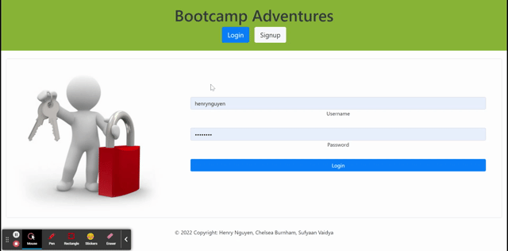
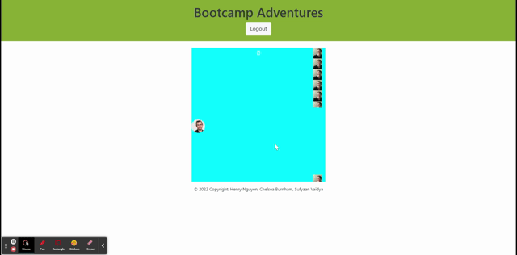

# Bootcamp-Adventures

 

<h3 align="center">Animal Crusade</h3>

  

    Help Jerome get to the end of the bootcamp
     
  

  
Table of Contents

  <ol>
    <li>
      <a href="#about-the-project">About The Project</a>
      <ul>
        <li><a href="#tools-used">Tools used</a></li>
      </ul>
    </li>
    <li>
      <a href="#instructions">Instructions</a>
        </li>
    <li><a href="#Collaborators">Collaborators</a></li>
    <li><a href="#license">License</a></li>
    <li><a href="#contact">Contact</a></li>
  </ol>

## About The Project

The motivation behind this project was to build an interactive game inspired by the most talented developer in the known universe, the one and only, Jerome Chenette. Utilizing the magic of React, Node.js and styled-components, we created a game inspired by Flappy Bird. The mission of the game is help Jerome navigate through bootcamp by avoiding the overpowering TA towers. 

(<a href="#top">back to top</a>)

### Tools used

* JavaScript
* React
* Node.js
* GraphQL
* MongoDB
* React Modal
* CSS
* Styled-components

(<a href="#top">back to top</a>)

## Instructions

Once you have navagated to the deployed link below:
  
[Deployed Link](https://jeromes-bootcamp-adventure.herokuapp.com/)

- Are prompted to create an account or login if you already have an account.
- Once you login, you are able to play the game helping Jerome navigate through the bootcamp by avoiding the TA towers
- During each round, your score is presented at the top of the game window and highscores are saved to your account. 

<b>Signup:</b>
 
The sign in and login pages utilize GraphQL to store usernames and passwords. User information are encrypted using Bcrypt when users create accounts before they are saved in the Apollo database, as well as when logging in to compare the user inputted login data to the data saved within the database. Once logged in, a token is saved on the client's local storage so the login persists on page reloads. 

<b>Login</b>
 

<b>Game:</b>
 
The game was created using useStates for the position of the main character, the postion and height of each obstacle and the score. The obstacles randomly filters between four images, each of which is a powerful TA. The random filter is done by creating a useState for a random number between 0 and 3, which is inserted into a template literal style component that will randomly replace the background image of the obstacle every 3.5 seconds. As the obstacles moves leftwards towards the main character, we used a useEffect to detect whether or not there is a collision between the main character and each of the obstacles during each movement frame. This is done by checking if the main character is in the same frame as one of the obstacle towers.

<b>Highscore Modal:</b>
 
A modal will appear at the end of each game presenting the player with their scores. These modal was created utizing the react-modal package.

(<a href="#top">back to top</a>)

## License

Distributed under the MIT License. See `LICENSE.txt` for more information.

(<a href="#top">back to top</a>)

## Contact

[Henry Nguyen](hln11244@gmail.com) 

[Chelsea Burnham](chelseaburnham0@gmail.com)

[Sufyaan Vaidya](vaidyasufyaan@gmail.com)

